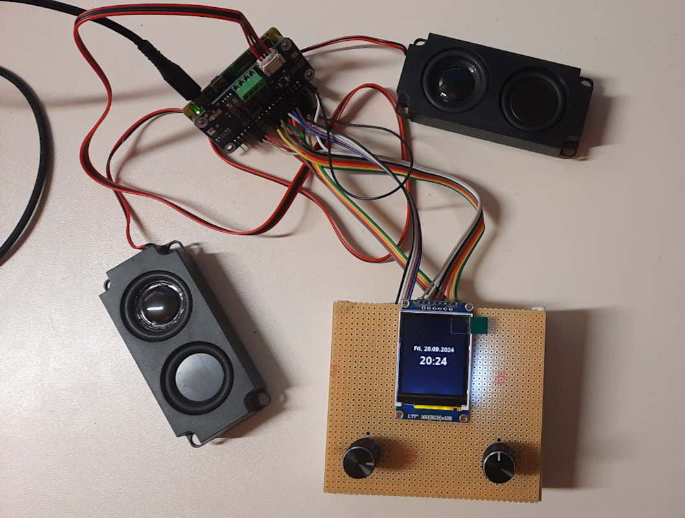
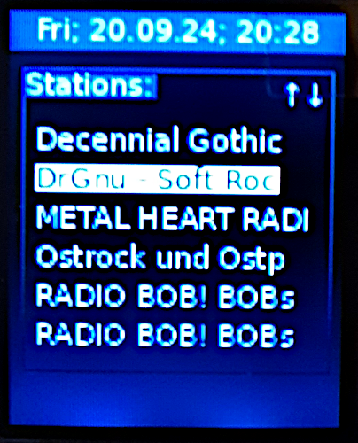
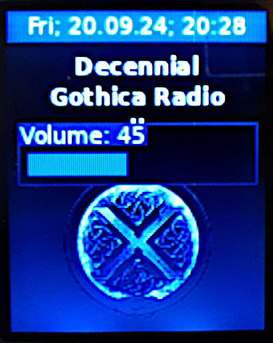

# IRadio

Ein einfaches Internetradio, welches sich mit zwei Drehimpulsgebern bedienen lässt. Als Hardware wurde verwendet:

* hier ein Rasberry Pi Zero W (jeder gängige andere Raspberry Pi sollte auch funktionieren)
* [ein Audio-HAT](https://www.waveshare.com/wiki/WM8960_Audio_HAT); im gekauften Set waren zwei Mini-Lautsprecherboxen enthalten
* [zwei Drehimpulsgeber](https://cdn.shopify.com/s/files/1/1509/1638/files/Drehimpulsgeber_Modul_Datenblatt.pdf?349756184529908641) für:
    * Radio an/aus
    * Lautstärke
    * Stationsauswahl
    * Umschaltung zwischen verschiedenen Bildschirminhalten

Hier ein Bild des Testaufbaues:

Die "Firmware", also mehr die Bedienoberfläche, wurde in Python implementiert. Natürlich wurden dabei die Vorteile einer funktionierenden Linux-Umgebung ausgenutzt. Für eine ausführliche Dokumentation wird auf den Quelltext verwiesen...;-)...

Hier einige Bildschirminhalte in unterschiedlichen Situationen:

Achso, dieses Projekt verwendet eine, wenn im entsprechenden Verzeichnispfad vorhandene Stationslisten-Datenbank (siehe Quelltext), welche ich bereits in einem meiner anderen [Projekte](https://github.com/boerge42/pyIRadio) verwendet hatte! Mit dem dort aufgeführten Python-Script *import_stations.py* und der Bedienoberfläche *pyiradio.py* kann die Datenbank erzeugt und/oder konfiguriert werden. Ist das entsprechende sqlite3-DB-File nicht vorhanden, werden Default-Stationen, welche im Quelltext definiert sind, verwendet.

Um "IRadio" automatisch beim Hochlauf des Raspberry Pi zu starten, könnte man dies durch systemd erledigen lassen. Eine entsprechende Konfigurationsdatei ist im Repository enthalten.

-----
Have fun!

Uwe Berger, 2024

