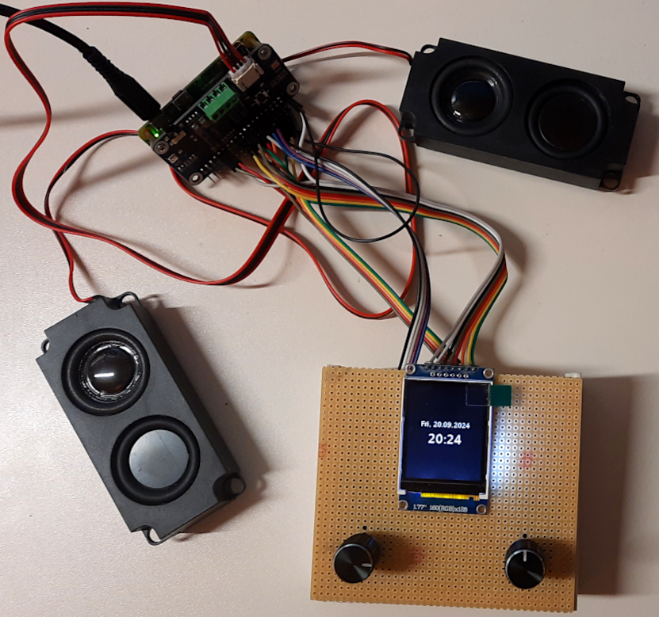
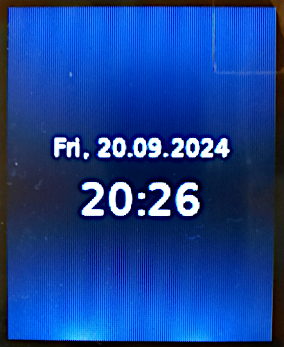

# IRadio

Ein einfaches Internetradio, welches sich mit zwei Drehimpulsgebern bedienen lässt. Als Hardware wurde verwendet:

* hier ein Rasberry Pi Zero W (jeder andere gängige Raspberry Pi sollte auch funktionieren)
* ein [Audio-HAT](https://www.waveshare.com/wiki/WM8960_Audio_HAT); im gekauften Set waren zwei Mini-Lautsprecherboxen enthalten
* ein [1,77"-TFT-Display](https://cdn.shopify.com/s/files/1/1509/1638/files/1_77_Zoll_SPI_TFT_Display_Datenblatt_AZ-Delivery_Vertriebs_GmbH_0eab71a3-f0c9-42af-8089-d8e6f689e9dc.pdf?v=1606166813), ohne Touch, weil...
* zwei [Drehimpulsgeber](https://cdn.shopify.com/s/files/1/1509/1638/files/Drehimpulsgeber_Modul_Datenblatt.pdf?349756184529908641) für:
    
    * Drehimpulsgeber 1:
        * Radio an/aus
        * Lautstärke
    * Dreimpulsgeber 2:
        * Stationsauswahl
        * Umschaltung zwischen verschiedenen Bildschirminhalten

Hier ein Bild des Testaufbaues:

Die "Firmware", also mehr die Bedienoberfläche, wurde in Python implementiert. Natürlich wurden dabei die Vorteile einer funktionierenden Linux-Umgebung ausgenutzt. Für eine ausführliche Dokumentation wird auf den [Quelltext](https://github.com/boerge42/IRadio/blob/main/iradio.py) verwiesen!

Hier einige Bildschirminhalte in unterschiedlichen Situationen:

Radio aus...; Anzeige von Datum und Uhrzeit:

Ausgabe von Stationsname und -logo des gerade ausgewählten Streams:

Ausgabe von Informationen (Titel, NowPlaying, Genre) zum momentan abgespielten Stream:

Stationsauswahlliste:

Lautstärke:

Achso, dieses Projekt verwendet eine, wenn im entsprechenden Verzeichnispfad vorhandene (siehe [Quelltext](https://github.com/boerge42/IRadio/blob/main/iradio.py)), Stationslisten-Datenbank, welche ich bereits in einem meiner anderen [Projekte](https://github.com/boerge42/pyIRadio) verwendet hatte! Mit dem dort aufgeführten Python-Script *import_stations.py* und der Bedienoberfläche *pyiradio.py* kann die Datenbank erzeugt und/oder konfiguriert werden. Ist das sqlite3-DB-File nicht vorhanden, werden Default-Stationen, welche im [Quelltext](https://github.com/boerge42/IRadio/blob/main/iradio.py) definiert sind, verwendet.

Um "IRadio" automatisch beim Hochlauf des Raspberry zu starten, könnte man dies durch systemd erledigen lassen. Eine entsprechende [Konfigurationsdatei](https://github.com/boerge42/IRadio/blob/main/iradio.service) ist im Repository enthalten.

-----
Have fun!

Uwe Berger, 2024

